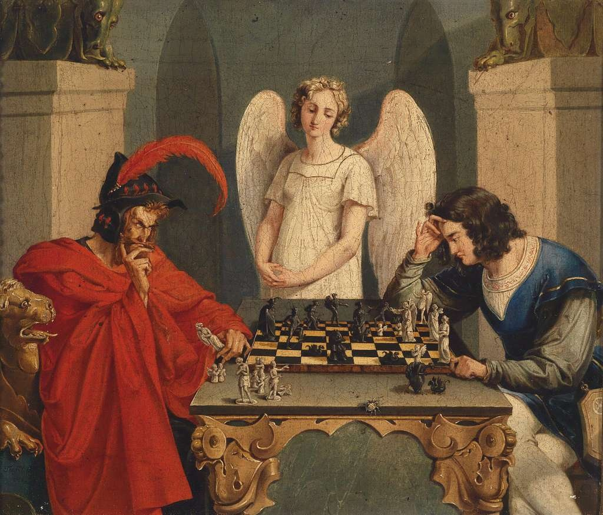

# The Devil's Game

A research article by Setvin Noether ([@SauerNinja](https://github.com/SauerNinja)) · 112 chapters · ~157 minute read

A long-form study of Moritz Retzsch's 1831 painting *The Chess Players* — the Faustian bargain, narcissistic extraction, the neuroscience of threat perception, and the philosophy of self-mastery, all read through a single chess match against the Devil.

The painting shows a young man playing chess against Satan for his soul, with a guardian angel watching in silence between them. Nineteenth-century publishers renamed the piece *Checkmate* — but the position, as chess historians (and Paul Morphy) have long argued, isn't actually lost. That gap, between what looks true and what is true, is the spine of this piece.

A hundred and twelve chapters trace the idea across eight parts, an epilogue, an honest accounting of open questions, a timeline, and a glossary: the painting's iconography and hidden symbolism; the actual chess position and Morphy's famous rebuttal of it — including a fully worked example of a hidden winning move; the psychology of the Faustian bargain, narcissistic extraction, and Machiavellian strategy; the clinical literature on self-erasure, attachment, and enmeshment in relationships; the neuroscience of threat perception, loss aversion, and cognitive load; the philosophy of Schiller, Plato, and Goethe on holding reason and appetite together; the "metagame" of institutional and administrative pressure; and, finally, the Stoic philosophy of stepping back far enough to see the board clearly.

## Contents

Read the full article: [`index.html`](index.html)

## License

MIT Licensed. Thoughts by Setvin Noether ([@SauerNinja](https://github.com/SauerNinja)).

### Suggested citation

Setvin Noether (2026). *The Devil's Game*.
